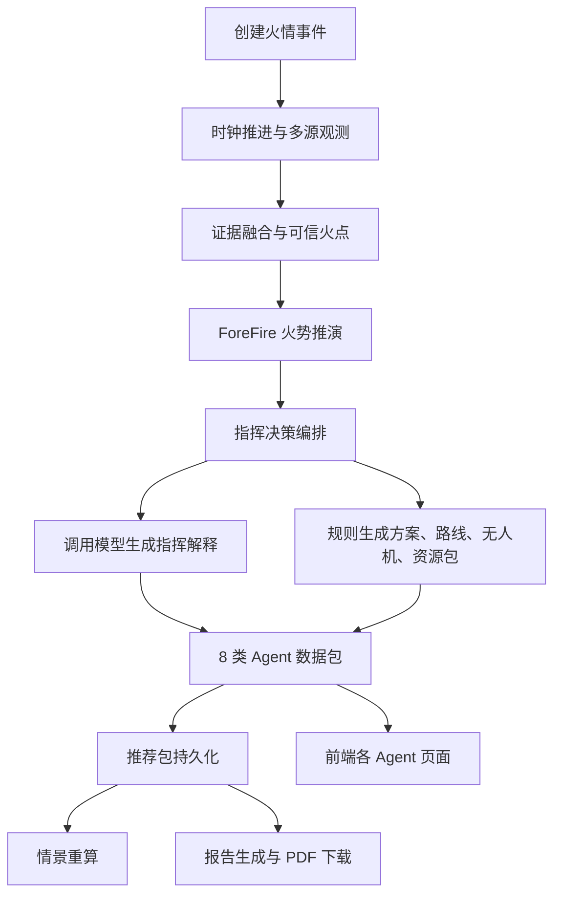

# 星火智援当前智能体技术梳理与比赛讲解稿

> 本文只说明当前项目真实实现，不要求实际替换现有模型。适用于团队学习、创赛 PPT、路演讲稿和评委问答准备。

## 1. 一句话定义项目里的智能体

星火智援不是让大模型独立计算火势并直接调度救援力量，而是采用混合智能体架构：

> 多源感知和 ForeFire 提供可信数据，规则与算法完成关键计算，大模型负责理解结构化结果和生成指挥解释，后端编排器把所有结果转换为多个标准 Agent 数据包，前端再将这些数据包投射到不同业务页面。

这套架构的关键词是：

- 机理模型负责可验证计算；
- 规则负责安全边界；
- 大模型负责认知与表达；
- 数据包负责智能体之间的协作；
- 人员负责最终决策。

## 2. 当前智能体到底是什么状态

当前代码中没有多个独立运行、彼此自由对话的大模型进程。`fire_agent_backend/app/agents` 目录目前只有包定义，实际编排集中在 `decision_service.py`。

因此当前系统属于：

```text
单一后端编排器
    + 多个业务角色
    + 一个可替换模型调用点
    + 多类结构化 Agent 数据包
    + 多个确定性工具和规则节点
```

从用户界面看，它表现为多个智能体：环境评估、融合、推演、指挥、路径、无人机、资源和报告智能体；从代码运行时看，它们目前主要是同一编排服务产生的不同业务数据包。

这可以准确称为：

> 多角色智能体编排原型，或基于数据包协议的混合智能体系统。

暂时不应称为：

> 多个完全自治智能体自主协商并直接执行救援任务。

## 3. 智能体角色与真实实现

| 界面角色 | 输入 | 输出 | 当前技术实现 | 是否直接调用大模型 |
|---|---|---|---|---|
| 环境评估 Agent | 时间、场景、气象参数 | 温度、湿度、风速、风向、火险指数 | 时钟驱动的环境快照 | 否 |
| 多源融合 Agent | 卫星、无人机、瞭望塔、林冠、地面传感器 | 证据权重、融合置信度、可信火点 | 加权融合规则 | 否 |
| 火势推演 Agent | 可信火点、气象、推演时长 | 火线时间步、面积、半径、风险基础值 | ForeFire 优先，简化模型兜底 | 否 |
| 指挥决策 Agent | 火势摘要、风速、火险指数 | 指挥解释、推荐方案、候选方案 | 规则计算 + 单次模型解释调用 | 是，解释层 |
| 路径规划 Agent | 推荐方案、火点、路线模板 | 主路线、备用路线、救援接近路线 | 确定性模板与几何规范化 | 否 |
| 无人机调度 Agent | 火线和路线任务 | 火线复核、通道巡检任务 | 确定性任务模板 | 否 |
| 资源调度 Agent | 风险等级、火点、风向 | 队伍、装备、A/B/C 分区 | 规则生成和地图几何计算 | 否 |
| 报告 Agent | 前述全部结果 | Markdown/PDF 报告 | 数据汇总和报告模板 | 间接使用模型摘要 |

## 4. 从点击按钮到智能体结果的完整流程



### 4.1 创建事件

用户选择木里或平遥场景，前端调用：

```http
POST /api/events/simulated/start
```

后端创建火情事件、场景 ID、初始火点和时间线记录。后续全部智能体结果都挂在同一个 `event_id` 下，保证不同页面使用的是同一事件状态。

### 4.2 推进证据

前端先启动时钟，然后暂停自动运行，按 5 分钟步长推进 6 次，总计推进 30 分钟。

随着时间推进，系统依次生成：

- 卫星宽域热异常；
- 地面环境异常；
- 林冠传感异常；
- 瞭望塔烟点；
- 高分红外复核；
- 无人机低空复核；
- 无人机火线跟踪。

当前两个演示事件通常各生成 7 条观测。

### 4.3 多源融合

每类传感器具有不同可靠性系数：

```text
卫星 satellite        0.78
无人机 uav            0.93
瞭望塔 watchtower     0.82
林冠传感 canopy       0.74
地面传感 ground       0.79
```

每条证据的原始贡献近似为：

```text
证据贡献 = 观测置信度 × 来源可靠性
```

位置使用归一化权重进行加权平均：

```text
weight_i = score_i / sum(score)
longitude = sum(longitude_i × weight_i)
latitude  = sum(latitude_i × weight_i)
```

融合置信度还会根据来源覆盖数量增加奖励。旧批处理路径要求：

```text
融合置信度 >= 0.82 且来源类型 >= 4
```

时钟驱动路径要求来源类型至少达到 3。满足条件后生成 `TrustedFirePoint`，它成为后续火势推演和地图定位的统一锚点。

这就是系统为什么能在木里和平遥两个事件中把地图中心切换到真实事件位置，而不是使用固定坐标。

### 4.4 ForeFire 火势推演

火势推演必须等待可信火点生成。后端将以下信息发送给 ForeFire：

- 火点经纬度与置信度；
- 温度、湿度、风速、风向；
- 可燃物湿度和火险指数；
- 推演时长与步长。

当前页面默认请求：

```json
{
  "horizon_minutes": 120,
  "step_minutes": 30,
  "prefer_forefire": true
}
```

ForeFire 返回火线 GeoJSON，后端转换成多个 `FireFrontStep`，并计算：

- 每个时间步的火线；
- 最终过火面积；
- 最大扩展半径；
- 推演方向；
- 风险等级。

如果 ForeFire 不可用，后端会生成椭圆火线作为简化兜底，并设置 `fallback_used=true`。因此演示时可以清楚区分真实机理推演和兜底推演。

## 5. 大模型在当前系统中的真正作用

当前大模型只在“Agent 决策”阶段调用一次。

后端先把工具结果压缩为：

```json
{
  "input_summary": {
    "final_area_km2": 1.3345,
    "risk_level": "medium",
    "wind_speed_m_s": 4.7,
    "fire_weather_index": 14.3
  }
}
```

系统提示词要求模型：

```text
你是森林火灾早期指挥决策智能体。
只解释结构化工具结果，不得编造数值。
```

模型返回的是一段指挥建议解释。它主要进入：

- 综合建议摘要；
- 决策记录的原始模型输出；
- 报告摘要；
- 前端智能体说明卡片。

模型当前不直接决定：

- 可信火点；
- 火势面积和半径；
- 风险阈值；
- 路线几何；
- A/B/C 分区；
- 队伍人数和装备数量；
- 是否真正派发无人机或车辆。

这样设计的原因是，应急指挥属于高风险场景。关键数值和动作需要可验证、可复现、可审计，不能只依赖大模型自由生成。

## 6. 多智能体协作是怎样体现的

决策编排器一次生成 8 类标准数据包：

```text
situation_packet                 态势包
risk_packet                      风险包
plan_packet                      方案包
recommendation_packet            综合建议包
uav_recommendation_packet        无人机任务包
route_recommendation_packet      路径推荐包
resource_recommendation_packet   资源调度包
report_packet                    报告包
```

这些数据包是当前智能体协作的协议层。

例如：

```text
融合 Agent 输出可信火点
        ↓
推演 Agent 使用该火点生成火线
        ↓
指挥 Agent 使用火线和环境摘要形成方案
        ↓
路线、无人机、资源 Agent 将方案拆成可执行任务
        ↓
报告 Agent 汇总全部数据包
```

前端不是重新计算这些结果，而是读取相同的数据包，在不同页面中展示不同视角。

## 7. 指挥方案、路线和资源如何生成

### 7.1 风险等级

风险由最终过火面积、火险指数和可信火点置信度共同判断：

```text
高风险：面积 >= 4.5 km²，或 FWI >= 24，或可信度 >= 0.90
中风险：面积 >= 1.2 km²，或 FWI >= 14，或可信度 >= 0.78
否则为低风险
```

### 7.2 推荐方案

当前主推荐方案是“下风向复核与保护目标力量前置”。方案根据风险等级获得不同分数，并附带：

- 预计过火面积；
- 当前风速和风向；
- 火险指数；
- 可信火点位置。

系统同时生成“侦察优先”和“资源前置”等候选方案，形成方案比较界面。

### 7.3 路径 Agent

当前生成三类路径：

- 主疏散路线；
- 备用疏散路线；
- 救援接近路线。

推荐服务把路线转换为地图可绘制的 `LineString`，并保存路线风险、原因和状态。

### 7.4 无人机 Agent

当前主要生成两类任务：

- 沿下风向火线进行热红外复核；
- 检查主、备用疏散通道的通行状态。

无人机任务只是一份推荐任务包，不代表真实飞控指令已经发送。

### 7.5 资源 Agent 与 A/B/C 分区

资源 Agent 生成前方指挥组和资源调度组等任务，并根据可信火点、风向和火势半径动态计算三区：

- A 区：下风向重点监测与保护区；
- B 区：侧翼控制与备用通道区；
- C 区：上风向指挥与集结安全区。

分区并非固定画在木里地图上，而是通过经纬度偏移和方向向量围绕当前可信火点生成。因此切换到平遥事件后，分区会移动到平遥火点附近。

## 8. 情景重算为什么算智能体能力

指挥中心支持以下扰动：

- 风向突变；
- 道路不可用；
- 无人机可用数量下降；
- 保护目标优先级改变；
- 天气风险升高。

系统不会重新开始整个事件，而是在已有推荐包上生成快照，应用扰动规则，然后输出新的路线、无人机和资源排序。

它体现的是智能体的“感知变化后重新规划”能力：

```text
原方案 -> 新扰动 -> 影响分析 -> 推荐包重算 -> 前后方案对比
```

当前重算主要由规则完成，未来可以让模型负责解释变化原因，但仍应由规则验证最终结果。

## 9. 前端如何呈现智能体状态

前端 `fireEventStore` 将后端数据包映射为统一状态：

- `trustedFirePoint`：可信火点；
- `spreadRun / spreadSteps`：推演记录与火线；
- `decisionRun`：模型提供方、模型名、置信度；
- `agentPackets`：全部 Agent 数据包；
- `recommendationPackage`：路径、无人机、资源推荐；
- `latestRecalculation`：情景重算结果；
- `latestReport`：最终报告。

顶部流程状态按以下顺序变为完成：

```text
环境评估 -> 火点融合 -> 火势推演 -> 指挥决策
```

地图则根据当前页面模式选择展示：火点、火线、路径、无人机、资源或 A/B/C 分区。

## 10. 比赛中应该怎样讲 MiMo

如果当前运行环境没有真实调用 MiMo，不应说“当前 Demo 已经由 MiMo 完成远程推理”。可以准确地说：

> 系统在模型层采用可插拔 Provider 设计，智能体编排与模型厂商解耦。面向赛事要求，我们将 MiMo 定位为认知解释和方案生成层；机理推演、可信火点和安全约束仍由 ForeFire、融合算法和规则工具负责。

也可以说：

> 当前 Demo 重点验证的是智能体的数据闭环、工具链和多角色协作协议。模型只接收经过脱敏和压缩的结构化态势摘要，因此模型替换不会影响事件、推演、地图和任务包主链路。

不能说：

> MiMo 已经独立计算火势并自主调度全部救援力量。

如果比赛规则把“实际调用 MiMo API”作为硬性验收项，那么当前不切换模型会构成合规风险。这不是讲稿能规避的问题，需要团队提前确认赛事的验收方式。

## 11. 路演时可直接使用的 90 秒技术讲稿

> 星火智援采用混合智能体架构，不让大模型直接猜测火势或控制救援设备。系统首先通过卫星、无人机、瞭望塔和地面传感数据建立证据链，按照不同数据源可靠性进行加权融合，生成可信火点。随后，ForeFire 机理模型根据火点、风速、风向和火险指数生成火线时间序列。指挥决策智能体读取这些经过工具验证的结构化结果，由模型完成风险解释和方案表达，后端再将结果编排为态势包、风险包、方案包、路径包、无人机包、资源包和报告包。路线、A/B/C 分区和资源数量均由规则与几何算法校验，模型不直接下达真实设备指令。当道路、风向或无人机数量发生变化时，系统能够进行情景重算并输出新的任务排序。这样既利用了大模型的理解和生成能力，又保留了应急决策所需的可验证性、可复现性和人工确认机制。

## 12. 评委常见问题与回答

### 问：你们的多智能体是真的多个 Agent 吗？

答：当前是多角色数据包编排原型。后端以统一事件为上下文，生成环境、风险、方案、路径、无人机、资源和报告等 Agent 数据包。每个角色有独立输入输出协议，但当前主要由一个编排器统一执行。未来可把各角色逐步拆成独立 MiMo 调用节点。

### 问：大模型在里面到底做了什么？

答：模型读取 ForeFire 和融合算法输出的结构化摘要，生成风险解释和指挥建议文本。关键数值、地图几何和资源约束由工具和规则生成，避免模型幻觉影响高风险决策。

### 问：为什么不用大模型直接算火势？

答：火势传播涉及物理机理、地形、气象和燃料数据，ForeFire 的结果可复现、可验证。大模型更适合跨数据理解、方案表达和人机交互，不适合代替物理仿真。

### 问：如果模型断网怎么办？

答：模型层具有结构化规则兜底。模型不可用时，事件、融合、推演、路线和资源链路仍能运行，只是自然语言解释能力降级。

### 问：如何防止模型编造数据？

答：模型只接收工具生成的摘要，提示词明确禁止编造数值；后续还应使用 JSON Schema 校验、数值回填和安全审查 Agent，所有高风险任务必须人工确认。

### 问：你们的创新点是什么？

答：创新点不只是接入一个大模型，而是把多源融合、ForeFire 机理推演、模型认知解释、地图任务包和情景重算串成同一事件闭环，并用标准数据包连接不同智能体角色。

## 13. 建议的 PPT 技术部分结构

```text
第 1 页：混合智能体总体架构
第 2 页：多源证据融合与可信火点
第 3 页：ForeFire 机理推演工具
第 4 页：模型调用与 Agent 数据包协议
第 5 页：路径、无人机、资源与 A/B/C 分区
第 6 页：情景重算与人机协同安全机制
第 7 页：当前边界与未来演进
```

每页只讲一个问题：

- 数据从哪里来；
- 哪些结果由工具算；
- 模型在哪里参与；
- 数据包怎样连接角色；
- 如何保证安全可信；
- 未来怎样升级为真正的多 Agent 协作。

## 14. 当前实现的优势与不足

优势：

- 全流程已经贯通，可实际演示；
- 两个事件可以复现；
- 火势计算与模型生成分离；
- Agent 数据包结构清晰；
- 支持情景重算和报告归档；
- 大模型失效时主业务仍可运行。

不足：

- 多个 Agent 尚未拆成独立运行节点；
- 模型只看到较小的态势摘要；
- 模型输出仍是自由文本，缺少 JSON Schema；
- 远程调用状态、耗时和 Token 尚未完整记录；
- 路径和资源推荐仍有较多模板化逻辑；
- 人工审批节点尚未形成完整工作流。

未来方向：

- 把态势、风险、方案、安全审查和报告角色拆成独立 MiMo Agent；
- 引入应急预案和历史案例 RAG；
- 使用工具调用生成结构化方案；
- 加入安全审查 Agent 和人工确认节点；
- 接入真实传感器、GIS、资源台账和任务回传；
- 建立模型效果、延迟、成本与安全评估体系。

## 15. 关键代码入口

| 技术点 | 文件 |
|---|---|
| 时钟与时序证据 | `fire_agent_backend/app/services/clock_service.py` |
| 多源融合 | `fire_agent_backend/app/adapters/simulated_evidence_fusion.py` |
| 可信火点 | `fire_agent_backend/app/services/observation_service.py` |
| ForeFire 推演 | `fire_agent_backend/app/services/spread_service.py` |
| 模型适配层 | `fire_agent_backend/app/llm/providers.py` |
| Agent 数据包与决策编排 | `fire_agent_backend/app/services/decision_service.py` |
| 路径、无人机和资源包 | `fire_agent_backend/app/services/recommendation_service.py` |
| 情景重算 | `fire_agent_backend/app/services/recalculation_service.py` |
| 报告生成 | `fire_agent_backend/app/services/report_service.py` |
| 前端 Agent 页面 | `src/components/BackendDrivenPage.vue` |
| 前端状态映射 | `src/stores/fireEventStore.ts` |

