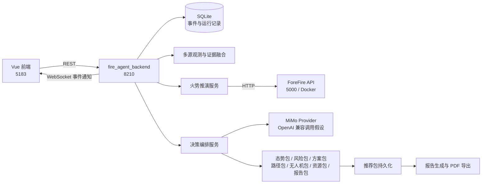
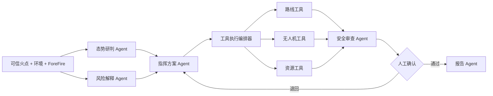

# 星火智援 MiMo 智能体接入与演进技术说明

> 适用项目：星火智援森林山火应急救灾智能系统  
> 适用范围：当前可运行 Demo、创赛技术答辩、MiMo 模型替换方案、后续智能体演进设计  
> 文档结论基于当前仓库代码，不把规划能力描述成已经实现的能力。

## 1. 先说结论

当前 Demo 已经具备一个可替换大模型的后端适配层。将模型由智谱 GLM 假设切换为小米 MiMo，业务主流程不需要重写，主要改动位于：

1. 后端 `.env` 中的模型提供方、模型名称、密钥和 API 根地址；
2. `fire_agent_backend/app/llm/providers.py` 中 MiMo 请求协议与正式服务保持一致；
3. 增加真实调用标记、耗时、Token 用量、错误和降级原因，防止“界面显示 MiMo，但实际走本地兜底”的误判；
4. 后续再把当前单次模型解释调用，演进为带结构化输出、工具调用、审核节点和多角色协作的智能体工作流。

必须准确描述当前实现：

- 火点融合、火势面积、风险等级、A/B/C 分区、路径与资源任务主要由后端确定性代码和 ForeFire 结果生成；
- MiMo 在当前设计中负责读取结构化态势摘要，生成一段指挥建议解释；
- 后端随后把确定性结果组织为多个“智能体数据包”，供前端不同模块展示；
- 当前并不是多个 MiMo 实例相互自由对话，也没有让模型直接控制无人机或调度资源。

这种设计适合比赛 Demo：关键数值可复现，模型负责理解和表达，算法与规则负责安全边界。它的正式技术名称可以表述为：

> 以机理模型和规则工具为可信底座、以大模型为认知解释层、以结构化数据包为协作协议的可控智能体编排系统。

## 2. 当前系统架构



主要组件及职责：

| 组件 | 当前职责 | 是否由大模型负责 |
|---|---|---|
| Vue 前端 | 触发事件、证据、推演、决策、推荐、报告流程并展示结果 | 否 |
| 多源观测与融合 | 生成观测、证据链、融合置信度和可信火点 | 否 |
| ForeFire | 根据火点和环境参数生成火线时间步 | 否 |
| 决策编排服务 | 校验前置数据、调用模型、计算风险、生成多个数据包 | 部分 |
| MiMo Provider | 根据结构化摘要生成指挥解释文本 | 是 |
| 推荐服务 | 规范化路径、无人机和资源任务并写入数据库 | 否 |
| 情景重算 | 针对风向、道路、无人机和保护目标变化重排结果 | 当前为规则计算 |
| 报告服务 | 汇总所有已生成结果并导出 Markdown/PDF | 主要为模板生成 |

## 3. 从页面按钮到模型调用的真实链路

前端统一页面组件位于 `src/components/BackendDrivenPage.vue`，数据访问位于 `src/api/modules.ts`，状态聚合位于 `src/stores/fireEventStore.ts`。

### 3.1 创建事件

前端操作：点击“创建”。

```http
POST /api/events/simulated/start
Content-Type: application/json

{
  "scenario_id": "muli_lier_village"
}
```

后端生成事件 ID、火点初始信息和时间线。当前内置场景包括：

- `muli_lier_village`
- `pingyao_liujian_gou_early_replay`

### 3.2 推进证据

前端依次执行：

```text
启动事件时钟 -> 暂停自动时钟 -> 每次推进 5 分钟，共推进 6 次 -> 刷新全部状态
```

相关接口：

```http
POST /api/events/{event_id}/clock/start
POST /api/events/{event_id}/clock/pause
POST /api/events/{event_id}/clock/step
GET  /api/events/{event_id}/observations
GET  /api/events/{event_id}/evidence-chain
GET  /api/events/{event_id}/fusion
GET  /api/events/{event_id}/trusted-fire-point
```

当前 Demo 的典型输出为 7 条观测、证据链、融合置信度和可信火点。此阶段不调用 MiMo。

### 3.3 火势推演

前端请求：

```http
POST /api/events/{event_id}/spread-runs
Content-Type: application/json

{
  "horizon_minutes": 120,
  "step_minutes": 30,
  "prefer_forefire": true
}
```

后端优先调用 ForeFire，生成火线时间步、最终面积、最大半径和风险基础信息。ForeFire 不可用时可使用简化模型兜底。此阶段不调用 MiMo。

### 3.4 Agent 决策

只有当以下数据已经存在时，后端才允许决策：

- 可信火点 `TrustedFirePoint`
- 环境快照 `EnvironmentSnapshot`
- 火势推演记录 `SimulationRun`

前端请求：

```http
POST /api/events/{event_id}/decision-runs
Content-Type: application/json

{
  "include_report": true
}
```

如需单次强制选择提供方，也可以传：

```json
{
  "force_provider": "mimo",
  "include_report": true
}
```

注意：当前 `include_report` 字段并不会在决策接口内部自动创建最终报告。现有前端仍会在后续单独调用“生成报告”接口。

### 3.5 推荐包与报告

```http
POST /api/events/{event_id}/recommendations/regenerate

{
  "status": "recommended"
}
```

该接口把决策数据包规范化为：

- 3 类路线候选；
- 无人机侦察任务；
- 队伍和装备调度任务；
- 地图可绘制的路径、节点和 A/B/C 分区。

报告接口：

```http
POST /api/events/{event_id}/reports

{
  "include_recalculation": true,
  "format": "markdown"
}
```

PDF 下载：

```http
GET /api/reports/{report_id}/download.pdf
```

## 4. MiMo 在当前 Demo 中具体怎么使用

### 4.1 Provider 选择

`get_llm_provider()` 根据配置选择适配器：

```text
LLM_PROVIDER=zhipu     -> ZhipuGLMProvider
LLM_PROVIDER=mimo      -> MimoProvider
LLM_PROVIDER=structured -> StructuredFallbackProvider
```

也可以在单次决策请求中通过 `force_provider` 覆盖默认提供方。

### 4.2 发送给 MiMo 的信息

当前版本不会把数据库、完整证据链或整份 ForeFire GeoJSON 直接发送给模型，而是只发送一个压缩后的摘要：

```json
{
  "input_summary": {
    "final_area_km2": 1.3345,
    "risk_level": "medium",
    "wind_speed_m_s": 4.7,
    "fire_weather_index": 14.3
  }
}
```

系统提示词为：

```text
You are an early wildfire command decision agent.
Explain only the structured tool results and do not invent numeric values.
```

这条提示词的目标是约束模型只解释工具结果，不自行编造火势面积、风速等数值。

### 4.3 请求协议

当前 `MimoProvider` 假设 MiMo 提供 OpenAI 兼容的 Chat Completions 接口：

```http
POST {LLM_BASE_URL}/chat/completions
Authorization: Bearer {LLM_API_KEY}
Content-Type: application/json

{
  "model": "<MIMO_MODEL_ID>",
  "messages": [
    {"role": "system", "content": "..."},
    {"role": "user", "content": "{'input_summary': {...}}"}
  ],
  "temperature": 0.2
}
```

后端从以下位置读取文本：

```text
choices[0].message.content
```

当前超时为 30 秒，没有自动重试、流式返回和 Token 用量记录。

### 4.4 模型输出被用在哪里

MiMo 返回的文本目前写入：

- `DecisionRun.raw_llm_output`
- `recommendation_packet.summary`
- `report_packet.summary`
- 推荐包和报告中的摘要展示

以下结果不是 MiMo 当前直接生成的：

- 风险等级阈值；
- 推荐方案名称、分数和主要理由；
- 3 条路线模板；
- 2 类无人机任务；
- 资源调度任务；
- A/B/C 分区几何；
- 情景重算规则。

这些结果由 `decision_service.py`、`recommendation_service.py` 和 `recalculation_service.py` 中的确定性逻辑生成。

## 5. 切换到 MiMo 的实际配置

### 5.1 后端 `.env`

在 `fire_agent_backend/.env` 中配置：

```dotenv
APP_NAME="Xinghuo Fire Agent Backend"
ENVIRONMENT=development
HOST=0.0.0.0
PORT=8210

LLM_PROVIDER=mimo
LLM_MODEL=<小米官方提供的准确模型 ID>
LLM_API_KEY=<MiMo API Key>
LLM_BASE_URL=<MiMo 官方 OpenAI 兼容 API 根地址>

FOREFIRE_API_URL=http://127.0.0.1:5000
FOREFIRE_TIMEOUT_SECONDS=300
```

重要说明：当前代码内置的默认地址是：

```text
https://api.mimo.example/v1
```

这是示例占位符，不是可用于生产的正式地址。接入时必须以小米官方控制台或正式接口文档提供的地址、模型 ID、鉴权方式和响应结构为准。

`LLM_BASE_URL` 应填写到版本根路径，不要重复附加 `/chat/completions`，因为代码会自动追加该路径。

### 5.2 前端配置

前端并不直接持有 MiMo 密钥，也不直接访问模型。它只访问正式后端：

```dotenv
VITE_FIRE_AGENT_API_BASE_URL=http://127.0.0.1:8210
```

这种方式可以避免密钥暴露在浏览器中，也便于统一审计、限流和降级。

### 5.3 启动顺序

```text
1. 启动 Docker 与 ForeFire API（5000）
2. 启动 fire_agent_backend（8210）
3. 启动 Vue 前端（5183 或 Vite 分配的端口）
4. 在页面执行创建 -> 推进证据 -> 火势推演 -> Agent 决策 -> 推荐包 -> 生成报告
```

后端启动示例：

```powershell
cd "C:\Users\Daisy\Desktop\GIS综合实习\星火智援\fire_agent_backend"
python run.py
```

前端启动示例：

```powershell
cd "C:\Users\Daisy\Desktop\GIS综合实习\星火智援"
npm run dev -- --host 127.0.0.1 --port 5183
```

## 6. 如何确认真的调用了 MiMo

只看前端显示的 `mimo / 模型名` 不足以证明远程调用成功。

当前存在一个需要特别注意的行为：如果 `LLM_PROVIDER=mimo` 但没有配置 API Key，`MimoProvider` 会调用本地 `StructuredFallbackProvider`，随后仍然把返回结果包装成：

```text
provider = mimo
model = 配置的 MiMo 模型名
used_remote = false
```

但是 `used_remote` 当前没有保存到 `DecisionRun`，前端也没有显示它。因此可能出现“界面显示 MiMo，实际没有请求远程 MiMo”的情况。

正式验收建议至少增加以下字段：

```json
{
  "provider": "mimo",
  "model": "<model-id>",
  "used_remote": true,
  "request_id": "...",
  "latency_ms": 1260,
  "prompt_tokens": 420,
  "completion_tokens": 180,
  "fallback_reason": "",
  "provider_status": "remote_success"
}
```

比赛演示时的验证标准：

1. 后端启动日志明确显示 MiMo 配置已加载，但不打印密钥；
2. 决策记录中 `used_remote=true`；
3. 保存服务商返回的请求 ID、耗时与 Token 用量；
4. 断开网络或清空密钥后，状态明确显示“本地规则兜底”，不能继续显示成真实 MiMo 调用；
5. 同一个事件允许重复运行 MiMo 和规则兜底，并比较结果。

## 7. 当前“多智能体”的实现边界

后端目前生成 8 类数据包：

| 数据包 | 页面角色 | 当前生成方式 |
|---|---|---|
| `situation_packet` | 环境评估 Agent | 规则组装环境与可信火点 |
| `risk_packet` | 火势推演 Agent | ForeFire 结果与风险规则 |
| `plan_packet` | 指挥决策 Agent | 确定性候选方案模板 |
| `recommendation_packet` | 综合建议 | MiMo 文本 + 结构化推荐方案 |
| `uav_recommendation_packet` | 无人机 Agent | 任务模板与风险等级 |
| `route_recommendation_packet` | 路径 Agent | 路线模板与几何规范化 |
| `resource_recommendation_packet` | 资源 Agent | 资源模板与动态 A/B/C 分区 |
| `report_packet` | 报告 Agent | 模型摘要与结构化结果汇总 |

因此当前更准确的描述是“多角色数据包编排”，而不是“多个自治智能体运行时”。前端把这些数据包分别投射到不同 Agent 页面，从用户体验上形成多智能体协同。

这不是缺点，但在答辩中应主动说明：

> 我们先实现了可复现、可审计的工具链和 Agent 协议，再逐步把各角色从规则节点替换为可独立评估的 MiMo 智能体。这样避免一开始就让大模型直接决定高风险应急动作。

## 8. 建议的 MiMo 智能体演进架构

### 8.1 第一阶段：增强当前单模型解释层

目标：保持当前 Demo 稳定，只增强可验证性。

- 使用官方 MiMo API 地址和准确模型 ID；
- 使用标准 JSON 序列化，不再通过 Python `str(dict)` 发送用户数据；
- 要求模型返回固定 JSON Schema；
- 记录远程调用状态、耗时、Token、请求 ID 和降级原因；
- 增加超时重试、指数退避和熔断；
- 在前端明确显示“MiMo 在线 / 规则兜底”。

推荐结构化输出：

```json
{
  "situation_summary": "...",
  "risk_interpretation": "...",
  "recommended_strategy": "...",
  "supporting_evidence": ["..."],
  "uncertainties": ["..."],
  "required_tool_checks": ["route_check", "resource_check"],
  "human_confirmation_required": true
}
```

### 8.2 第二阶段：单编排器、多角色 MiMo 调用

将当前 8 个数据包拆为 5 个真正可独立调用和评估的角色：



建议角色：

- 态势研判 Agent：解释证据链与可信火点，不直接下达任务；
- 风险解释 Agent：解释 ForeFire 输出、风向和不确定性；
- 指挥方案 Agent：生成多个结构化候选方案；
- 安全审查 Agent：检查越权、冲突、路线穿越火线和资源超配；
- 报告 Agent：将已批准结果转成正式报告。

工具执行仍由后端完成，模型只能提出工具调用意图，不能直接操作设备。

### 8.3 第三阶段：RAG 与知识约束

将以下材料建立向量索引或结构化知识库：

- 森林火灾应急预案；
- 地方资源清单与联络机制；
- 道路、避险点、水源和保护目标；
- 无人机操作规范；
- 历史火灾案例与复盘报告；
- 气象、地形和燃料模型说明。

MiMo 在生成方案前检索相关条款，并在输出中携带来源 ID。模型不能引用未检索到的规定。

### 8.4 第四阶段：闭环重算与持续评估

接入实时反馈后，系统可执行：

```text
任务派发 -> 状态回传 -> 新证据融合 -> 判断是否触发重算 -> 重新生成方案 -> 人工确认
```

当前已有的风向突变、道路不可用、无人机减少、保护目标变化和天气风险升高等重算逻辑，可以逐步升级为 MiMo 解释 + 确定性规则验证的混合模式。

## 9. 安全与工程约束

森林火灾属于高风险决策场景，未来接入 MiMo 时建议坚持以下边界：

1. 模型不直接控制无人机、车辆、警报或人员调度系统；
2. 数值来自数据库、传感器、GIS 和 ForeFire，模型只引用，不自行计算关键数值；
3. 所有模型输出经过 Pydantic/JSON Schema 校验；
4. 资源总量、路线安全距离、禁飞区等使用硬规则校验；
5. 高风险任务必须由指挥人员确认；
6. 保存输入摘要、模型输出、工具结果、审批人与最终版本，形成完整审计链；
7. 远程模型不可用时进入明确的规则兜底状态；
8. 不把人员隐私、精确敏感设施位置和密钥直接发送给模型服务。

## 10. 评估指标

MiMo 接入不能只用“回答看起来不错”评价。建议使用两个内置事件进行固定回放，记录：

| 指标类别 | 示例指标 |
|---|---|
| 接口可靠性 | 成功率、P95 延迟、超时率、降级率 |
| 输出稳定性 | 相同输入的结构字段一致率 |
| 事实一致性 | 输出数值与工具结果一致率 |
| 方案质量 | 专家评分、路线冲突率、资源超配率 |
| 安全性 | 编造数值率、越权任务率、必须人工确认命中率 |
| 成本 | 单次 Token、单事件成本、报告生成成本 |
| 可解释性 | 建议是否包含证据、风险、限制与不确定性 |

验收样例至少覆盖：

- 木里李尔村事件；
- 平遥胭脂沟事件；
- ForeFire 正常与兜底两种状态；
- MiMo 正常、超时、鉴权失败和无密钥四种状态；
- 道路不可用、风向突变、无人机减少等情景重算。

## 11. 创赛答辩可使用的技术表述

建议表述：

> 星火智援采用“机理模型 + 结构化工具 + 大模型认知层”的混合智能体架构。ForeFire 负责可验证的火势推演，多源融合模块负责生成可信火点，MiMo 读取结构化态势摘要，完成风险解释与指挥建议生成。后端再将结果编排为态势、风险、方案、路线、无人机、资源和报告等标准数据包。所有高风险动作均经过规则校验和人工确认，大模型不直接控制设备。

不建议表述：

> MiMo 自动计算火势、自动指挥所有救援力量，并自主完成全部应急决策。

原因是当前代码中火势和调度核心结果并不是由 MiMo 独立计算，而且正式系统也不应允许模型绕过工具和人工审批直接控制应急资源。

## 12. 接入验收清单

- [ ] 使用小米官方 API 根地址和准确模型 ID；
- [ ] 密钥只保存在后端环境变量或密钥管理服务中；
- [ ] `LLM_PROVIDER=mimo`；
- [ ] 真实调用标记持久化并在前端显示；
- [ ] 请求与响应使用 JSON Schema；
- [ ] 记录请求 ID、延迟、Token、错误和降级原因；
- [ ] 无密钥时明确显示规则兜底；
- [ ] 两个内置事件均完成全流程；
- [ ] 模型输出数值与工具结果一致；
- [ ] 高风险任务存在人工确认节点；
- [ ] API Key 不进入前端、不写入日志、不提交 Git；
- [ ] 完成超时、鉴权失败、限流和模型不可用测试。

## 13. 关键代码位置

| 内容 | 文件 |
|---|---|
| 模型配置 | `fire_agent_backend/app/core/config.py` |
| MiMo/GLM/规则适配器 | `fire_agent_backend/app/llm/providers.py` |
| 决策编排与 Agent 数据包 | `fire_agent_backend/app/services/decision_service.py` |
| 推荐包规范化 | `fire_agent_backend/app/services/recommendation_service.py` |
| 情景重算 | `fire_agent_backend/app/services/recalculation_service.py` |
| 报告与 PDF | `fire_agent_backend/app/services/report_service.py` |
| 决策接口 | `fire_agent_backend/app/routers/decisions.py` |
| 前端 API | `src/api/modules.ts` |
| 前端状态映射 | `src/stores/fireEventStore.ts` |
| Demo 操作按钮 | `src/components/BackendDrivenPage.vue` |
